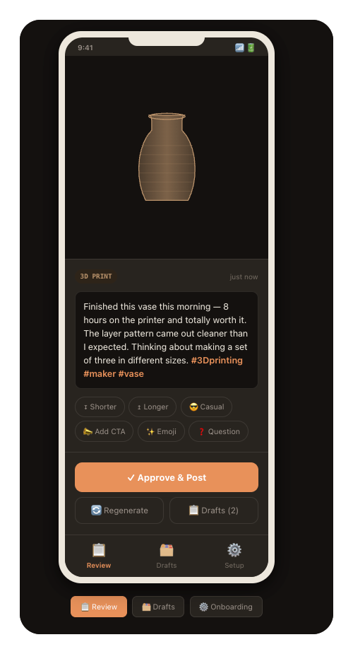

# Maker Post



> AI organizational assistant for solo makers — take a photo, everything else happens by itself.

Auto-classifies photos by project, surfaces post ideas when enough content accumulates, and stores experiment results as a reference library. Designed for Andrei, a part-time 3D-printing entrepreneur juggling 5–7 projects in parallel who loses "brain fuel" to organization, not creation.

## Principles

- **Dead-simple** — zero manual effort beyond taking photos
- **AI organizes, doesn't create** — user writes own captions; AI classifies, groups, surfaces ideas
- **Compounding knowledge** — reference library stores experiment results for future projects
- **Lean & visual** — everything you need, nothing you don't
- **Not AI slop** — quality floor; reflects the user's voice

## Architecture (selected: D — pipeline constant, ingest as spike)

| Part | Mechanism |
|------|-----------|
| **D1** | Ingest — auto-sync from iOS to Cloudflare R2 (⚠️ spike; fallback: iOS Shortcut) |
| **D2** | Cron Worker polls R2 for new unclassified photos |
| **D3** | Vision model classifies each photo → LLM clusters into project groups |
| **D4** | Project + classification store (D1/KV) |
| **D5** | Post-idea detector — surfaces ideas when threshold reached |
| **D6** | Web app — project gallery, post-idea list, status tracking |
| **D7** | PKM store — experiment notes linked to projects |
| **D8** | Optional AI caption draft (off by default) |

**Not in MVP:** Instagram posting, iOS Photo album management, content gap detection, trend analysis, video draft generation. See [shaping doc](docs/shaping.md#deferred--future) for full deferred list.

## Tech stack (planned)

- **Cloudflare Workers + R2 + D1/KV** — serverless API, object storage, metadata
- **OpenRouter** — free vision + text models (primary)
- **Web app** — project gallery, post-idea review, PKM reference

## Docs

```
maker-post/
├── README.md                       # this file
├── AGENTS.md                       # agent working rules
├── docs/
│   ├── frame.md                    # problem frame (why)
│   ├── shaping.md                  # requirements, shapes, fit check (v2)
│   ├── spike-ingest.md             # D1: auto-sync feasibility spike
│   ├── mindmap.md                  # living design mindmap
│   ├── progress.md                 # session progress log
│   ├── idea.md                     # original app idea
│   ├── maker-post-app-andrei-interview.md  # user interview
│   ├── architecture-options.md    # v1 architecture comparison (historical)
│   └── slices.md                   # v1 slices (to be re-sliced)
├── src/                            # Cloudflare Worker (placeholder)
└── web/                            # web review app (placeholder)
```

## Status

Shaping v2 complete. Next: breadboard Shape D → re-slice → implement.
